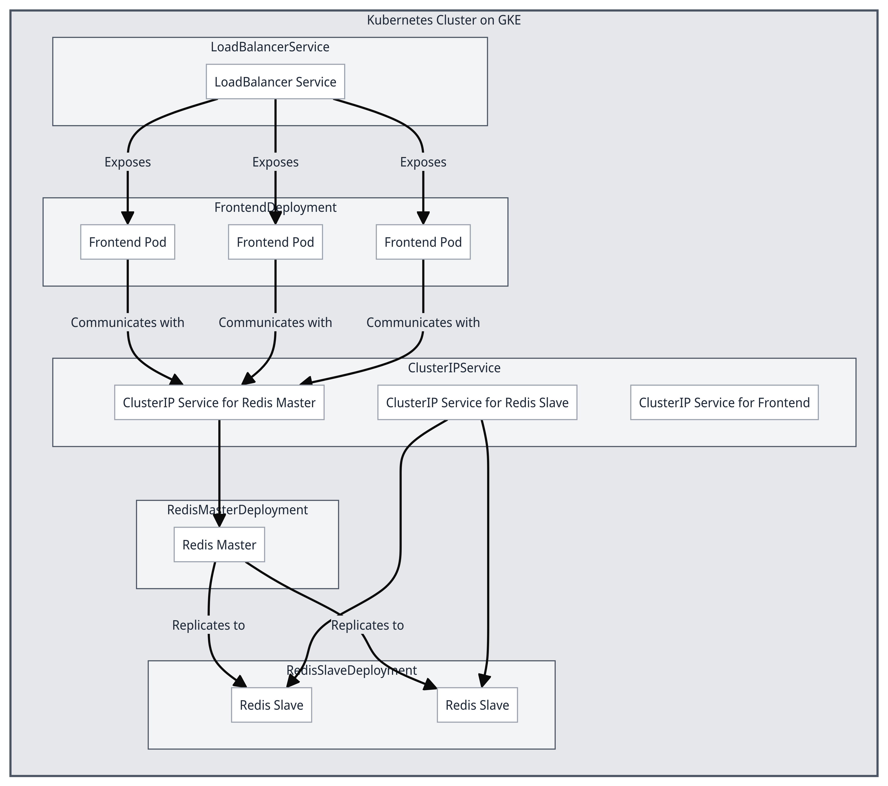

# RFTM-TUTORIAL-1

# Deploying N-Tier on GKS using Terraform and Helm.

## Project Review

### What We Learn from This Repository

This repository serves as a comprehensive demonstration of deploying a multi-tier application on Google Cloud Platform (GCP) using Kubernetes and Terraform. By following the steps and utilizing the provided files, users will gain hands-on experience with several advanced DevOps and cloud management techniques. Here’s a breakdown of the key skills and concepts showcased in this project:

1. **Infrastructure as Code with Terraform**
2. **Container Orchestration with Kubernetes**
3. **Google Kubernetes Engine (GKE)**
4. **Application Deployment**
5. **Continuous Integration and Deployment (CI/CD)**


### Why This Project Is Important

- **End-to-End Solution**
- **Modern DevOps Practices**
- **Scalability and Reliability**
- **Hands-On Experience**
### Application Architecture Overview

In this project, we are deploying an N-tier application using Kubernetes, managed through Helm charts on Google Kubernetes Engine (GKE). The application is a Flask-based web guestbook, which serves as a practical example of deploying a multi-tier application with multiple front-end and back-end instances and load-balanced traffic between them.

### Diagram




### Architecture Components

1. **Frontend Deployment**:
    - Contains three replicas of Flask application pods.
    - Handles HTTP requests from users and communicates with the Redis cluster for storing guestbook entries.
2. **Redis Master Deployment**:
    - A single replica serving as the master node for the Redis cluster.
    - Handles write operations and replicates data to Redis slaves.
3. **Redis Slave Deployment**:
    - Two replicas serving as slave nodes for the Redis cluster.
    - Handle read operations and replicate data from the Redis master.
4. **ClusterIP Services**:
    - Internal services to facilitate communication between the Flask application and Redis instances within the Kubernetes cluster.
    - Redis Master and Slave services expose Redis instances to the Flask application.
5. **LoadBalancer Service**:
    - Exposes the Flask application to the outside world.
    - Distributes incoming traffic across the available replicas of the Flask application.

### Data Flow

1. Users access the Flask application through the LoadBalancer service.
2. The Flask application (frontend pods) processes user requests and communicates with Redis for data storage.
3. Internal ClusterIP services manage communication between the Flask application and Redis instances.
4. Redis Master handles write operations and synchronizes data with Redis Slaves.
5. Redis Slaves handle read operations, improving scalability and performance.


This guide will walk you through the steps to set up a GCP project, create a service account, configure Terraform, SSH into Google Cloud Shell, install Helm, authenticate with a service account, deploy a Helm chart, and access the application using the external IP of the load balancer.

## Prerequisites

- Terraform installed locally
- Google Cloud SDK installed locally
- Helm installed locally or in Cloud Shell
- A Google Cloud project set up
- Service account with necessary permissions

## Steps

### 1. Setting Up GCP Project and Service Account

### Create a New GCP Project

1. Go to the Google Cloud Console.
2. Click on the project dropdown at the top of the page and select "New Project".
3. Enter a name for your project and click "Create".
4. Once the project is created, make note of the Project ID. You can find it on the dashboard or in the project dropdown.

### Create a Service Account

1. In the Google Cloud Console, navigate to "IAM & Admin" > "Service Accounts".
2. Click "Create Service Account".
3. Enter a name for the service account (e.g., "terraform").
4. Assign the "Editor" role to the service account.
5. Click "Done" to create the service account.
6. Click on the created service account to edit it, and then click "Add Key" > "Create New Key".
7. Choose JSON format and click "Create". Download the key file to your local machine.

### Move the JSON Key to Your Terraform Directory

Move the downloaded JSON key to the directory where your `main.tf` file is located:

```
mv ~/path/to/downloaded-key.json ~/path/to/terraform-directory/terraform-key.json
```

### 2. Setting Up Terraform

### Configure Terraform Backend

Create a unique bucket in GCS to store the Terraform state file. You can do this via the GCP Console or using the `gsutil` command. Also, create the necessary folder within the bucket:

```
gsutil mb gs://your-unique-bucket-name
gsutil mkdir gs://your-unique-bucket-name/terraform/state/file/prefix
```

### Update `main.tf` for Backend Configuration

Add the backend configuration in your `main.tf` file:

```
terraform {
  backend "gcs" {
    bucket      = "your-unique-bucket-name"
    prefix      = "terraform/state/file/prefix"
    credentials = "terraform-key.json"
  }
}
```

### Update Terraform Provider Configuration

Ensure your `provider "google"` block in `main.tf` is correctly configured:

```
provider "google" {
  credentials = file("path/to/your/terraform-key.json")
  project     = "your-project-id"
  region      = "us-central1"
  zone        = "us-central1-c"
}
```

### Initialize and Apply Terraform Configuration

1. **Initialize Terraform:**
    
    ```
    terraform init
    ```
    
2. **Reconfigure if necessary:**
    
    ```
    terraform init --reconfigure
    ```
    
3. **Apply Terraform configuration:**
    
    ```
    terraform apply
    ```
    
4. **Confirm the apply action and wait for the resources to be created.**

### 3. SSH into Google Cloud Shell

1. **Install Google Cloud SDK:**
    
    ```
    brew install --cask google-cloud-sdk
    ```
    
2. **Authenticate with Google Cloud:**
    
    ```
    gcloud auth login
    ```
    
3. **Set your Google Cloud project:**
    
    ```
    gcloud config set project your-project-id
    ```
    
4. **SSH into Google Cloud Shell:**
    
    ```
    gcloud cloud-shell ssh
    ```
    

### 4. Install Helm in Google Cloud Shell

1. **Download and Install Helm:**
    
    ```
    curl https://raw.githubusercontent.com/helm/helm/master/scripts/get-helm-3 | bash
    ```
    

### 5. Authenticate with Service Account

1. **Set the environment variable for the service account key:**
    
    ```
    export GOOGLE_APPLICATION_CREDENTIALS="path/to/your/terraform-key.json"
    ```
    
2. **Authenticate using the service account:**
    
    ```
    gcloud auth activate-service-account --key-file=$GOOGLE_APPLICATION_CREDENTIALS
    ```
    
3. **Configure kubectl to use the GKE cluster:**
    
    ```
    gcloud container clusters get-credentials <your-cluster-name> --zone <your-cluster-zone> --project <your-project-id>
    ```
    

### 6. Deploy Helm Chart

1. **Clone or navigate to your Helm chart directory:**
    
    ```
    git clone https://github.com/your-repo/your-helm-chart.git
    cd your-helm-chart
    ```
    
2. **Deploy the Helm chart:**
    
    ```
    helm install my-guestbook ./mychart
    ```
    
3. **To upgrade the Helm chart if needed:**
    
    ```
    helm upgrade my-guestbook ./mychart
    ```
    

### 7. Access the Application

1. **Get the external IP of the Load Balancer:**
    
    ```
    kubectl get services
    ```
    
2. **Access the application:**
    
    Open a web browser and navigate to the external IP address with the specified port (if any). For example:
    
    ```arduino
    http://<EXTERNAL-IP>
    ```
    

## Troubleshooting

- **Check Pod Logs:**
    
    ```
    kubectl logs <pod-name>
    ```
    
- **Check Service Endpoints:**
    
    ```
    kubectl get endpoints <service-name>
    ```
    
- **Ensure Network Policies are not restricting traffic:**
    
    ```
    kubectl get networkpolicies
    ```
    
- **Describe Services and Pods for more details:**
    
    ```
    kubectl describe service <service-name>
    kubectl describe pod <pod-name>
    ```
    

By following these steps, you should be able to set up and deploy your application on GKE using Terraform and Helm, and access it via the external IP of the load balancer.

